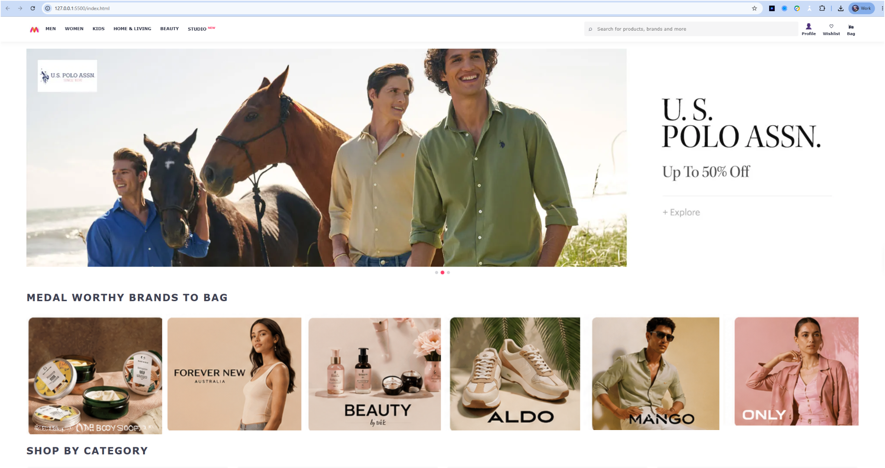
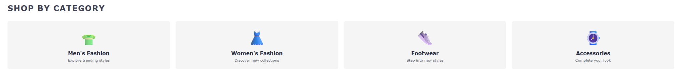

# 🛍️ Myntra Clone

A frontend recreation of the **Myntra e-commerce homepage** built using **HTML, CSS, and JavaScript**.

The project focuses on recreating the visual structure of Myntra with a navigation header, product search, promotional banners, brand sections, and an automatically rotating hero slideshow.

---

## 🖼️ Project Preview

### Desktop Homepage



### Navigation & Search


### Hero Banner


### Brand Showcase


### Shop by Category



### Mobile / Responsive View


---

## ✨ Features

* Myntra-inspired homepage layout
* Header navigation
* Men, Women, Kids, Home & Living, Beauty and Studio categories
* Product and brand search bar
* Profile section
* Wishlist section
* Shopping bag section
* Promotional hero banners
* Automatic image slideshow
* Featured brand section
* Responsive CSS-based layout
* Vanilla JavaScript functionality

---

## 🛠️ Tech Stack

| Technology | Usage                   |
| ---------- | ----------------------- |
| HTML5      | Page structure          |
| CSS3       | Styling and layout      |
| JavaScript | Slideshow functionality |
| Git        | Version control         |
| GitHub     | Repository hosting      |

---

## 📂 Project Structure

```text
Myntra-Clone/
│
├── Images/
│   ├── MyntraWebSprite_27_01_2021.png
│   └── logo-removebg-preview.png
│
├── screenshots/
│   ├── myntra-home.png
│   ├── myntra-navbar.png
│   ├── myntra-banner.png
│   ├── myntra-brands.png
│   └── myntra-mobile.png
│
├── index.html
├── script.js
├── style.css
├── utils.css
└── README.md
```

---

## 🚀 Getting Started

### 1. Clone the Repository

```bash
git clone https://github.com/sh1vesh/Myntra-Clone.git
```

### 2. Enter the Project Folder

```bash
cd Myntra-Clone
```

### 3. Run the Project

This project does not require Node.js or npm.

You can simply open:

```text
index.html
```

in your browser.

For a better development workflow, open the project in VS Code and use the **Live Server** extension.

---

## 🎞️ Automatic Slideshow

The homepage includes an automatically rotating promotional banner.

The JavaScript:

* finds all elements using the `mySlides` class
* hides the inactive slides
* displays the next slide
* automatically moves to another banner every 5 seconds

This creates a simple carousel-style homepage experience.

---

## 🧭 Navigation

The header recreates common Myntra navigation categories including:

* Men
* Women
* Kids
* Home & Living
* Beauty
* Studio

The right side also includes:

* Search
* Profile
* Wishlist
* Bag

---

## 🎯 Project Purpose

This project was created to practice:

* HTML page structure
* CSS layouts
* Flexbox
* Navigation design
* Responsive frontend development
* JavaScript DOM manipulation
* Basic slideshow functionality
* Git and GitHub workflows

---

## 🔮 Future Improvements

Possible future improvements include:

* Functional product search
* Product listing pages
* Shopping cart
* Wishlist functionality
* User authentication
* Category filtering
* Product detail pages
* Dynamic product data
* Local storage support
* Improved mobile navigation
* Fully responsive product grid
* Backend integration

---

## 👨‍💻 Maintainer

**Shivesh**

GitHub: [@sh1vesh](https://github.com/sh1vesh)

---

## ⚠️ Disclaimer

This project is created for **educational and demonstration purposes only**.

It is not affiliated with, endorsed by, or officially connected to **Myntra**.

All trademarks, logos, brand names, product imagery, and other proprietary assets belong to their respective owners.
