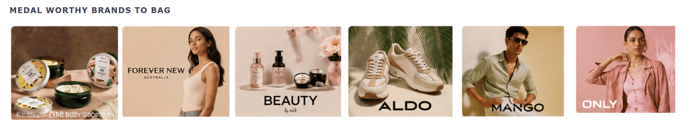
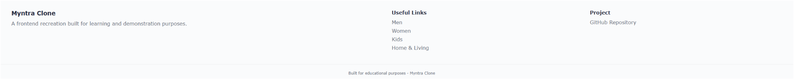
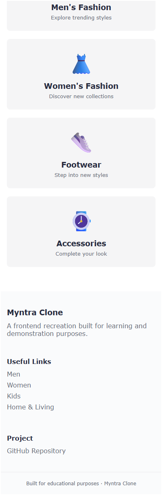

# 🛍️ Myntra Clone

A frontend recreation of the **Myntra e-commerce homepage** built using **HTML, CSS, and JavaScript**.

The project focuses on recreating the visual structure of Myntra with a navigation header, product search, promotional banners, featured brand sections, responsive category cards, and an automatically rotating hero slideshow.

---

## 🖼️ Project Preview

### Desktop Homepage


### Navigation & Search


### Hero Banner


### Brand Showcase



### Shop by Category


### Footer



### Mobile / Responsive View


### Mobile Footer / Stacked Layout



### Check the live project here : https://myntra-clone-eight-chi.vercel.app/
---

## ✨ Features

- Myntra-inspired homepage layout
- Responsive navigation header
- Men, Women, Kids, Home & Living, Beauty and Studio categories
- Product and brand search bar
- Profile section
- Wishlist section
- Shopping bag section
- Promotional hero banners
- Automatic image slideshow
- Manual slideshow navigation dots
- Featured brand showcase
- Shop by Category section
- Responsive brand grid
- Responsive category cards
- Desktop and mobile layouts
- Local image assets
- Vanilla JavaScript functionality

---

## 🛠️ Tech Stack

| Technology | Usage |
| --- | --- |
| HTML5 | Page structure and semantic markup |
| CSS3 | Styling, layout and responsive design |
| JavaScript | Slideshow and interactive functionality |
| Git | Version control |
| GitHub | Repository hosting and project documentation |

---

## 📂 Project Structure

```text
Myntra-Clone/
│
├── Images/
│   ├── MyntraWebSprite_27_01_2021.png
│   ├── logo-removebg-preview.png
│   ├── brand-01.png
│   ├── brand-02.png
│   ├── brand-03.png
│   ├── brand-04.png
│   ├── brand-05.png
│   └── brand-06.png
│
├── screenshots/
│   ├── myntra-home.png
│   ├── myntra-navbar.png
│   ├── myntra-banner.png
│   ├── myntra-brands.png
│   ├── myntra-categories.png
│   ├── myntra-footer.png
│   ├── myntra-mobile.png
│   └── myntra-mobile-footer.png
│
├── index.html
├── script.js
├── style.css
├── utils.css
└── README.md
